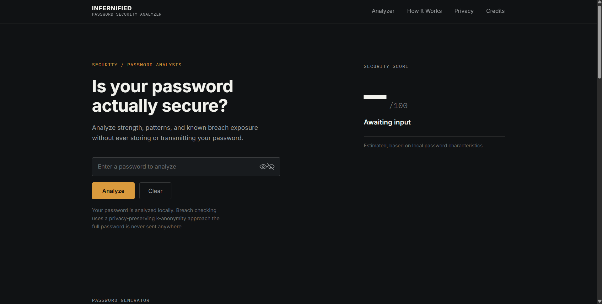

# Infernified

**Password Security Analyzer**

## Overview

Infernified is a privacy-conscious, educational password security analyzer. It helps
you understand password strength, composition, repeated and sequential patterns,
approximate entropy, and known breach exposure — all without ever storing or
transmitting your full password.

Everything runs client-side. The only network call the app makes is for the optional
breach check, and even then, only a partial hash prefix is sent — never the password
itself.

## Preview




## Features

- **Local password analysis** — length, character composition, repeated characters,
  sequential/keyboard patterns, and matches against a small list of well-known
  common passwords.
- **Approximate entropy estimate** — calculated from password length and character
  pool size.
- **Security score (0–100)** with classifications: Very Weak, Weak, Moderate, Strong,
  Very Strong.
- **Breach exposure check** using the Have I Been Pwned Pwned Passwords API, via
  k-anonymity — the full password never leaves the browser.
- **Password generator** with configurable length and character sets (uppercase,
  lowercase, numbers, symbols), using the browser's cryptographically secure random
  source (`crypto.getRandomValues`). Nothing generated is stored.
- **Editorial, restrained interface** — no dashboards, no glowing gauges, no cards
  for the sake of cards.
- **Accessible by design** — semantic HTML, visible focus states, keyboard
  navigation, and respect for reduced-motion preferences.
- **Responsive** — asymmetric desktop layout that adapts to a clear single-column
  layout on mobile.

## How It Works

```
Password
   ↓
Local analysis (length, composition, patterns, entropy, score)
   ↓
Local SHA-1 hashing
   ↓
HIBP k-anonymity prefix request (first 5 hash characters only)
   ↓
Local comparison against returned suffixes
   ↓
Security report
```

The strength analysis (score, composition, patterns, entropy) never touches the
network at all. The breach check hashes the password locally with SHA-1, sends only
the first five characters of that hash to the Have I Been Pwned range API, receives a
list of matching hash suffixes, and compares them locally in the browser. Only the
final result — found or not found — is shown.

## Privacy & Security

- Password analysis happens entirely in the browser.
- The password is never stored — not in a database, not in `localStorage` or
  `sessionStorage`, not in analytics, and not in console logs.
- The breach check uses a k-anonymity approach and never sends the full password or
  full password hash to any server.
- If the breach check fails or is unreachable, the app shows **"Breach check
  unavailable"** rather than falsely reporting a password as safe.

**Disclaimer:** Infernified provides an educational estimate of password strength and
known breach exposure. Results are not a guarantee of security and should not be
treated as a professional cybersecurity audit or legal advice.

## Tech Stack

- HTML5
- CSS3 (custom properties, CSS Grid, no framework)
- Vanilla JavaScript (ES2017+, `crypto.subtle`, `crypto.getRandomValues`, `fetch`)
- [Have I Been Pwned Pwned Passwords API](https://haveibeenpwned.com/API/v3#PwnedPasswords)
  (k-anonymity range endpoint)
- Fonts: Inter, IBM Plex Mono (Google Fonts)

No build step, no backend, no database, and no external JavaScript dependencies.

## Project Structure

```
infernified/
│
├── index.html
├── style.css
├── script.js
│
├── assets/
│   └── preview.png
│
└── README.md
```

## Getting Started

No build tools are required.

1. Clone or download the repository.
2. Open `index.html` directly in a browser, **or** serve it locally, e.g.:

   ```bash
   npx serve .
   ```

   or

   ```bash
   python3 -m http.server 8080
   ```

3. Visit the served URL (or the opened file) in your browser.

The breach-check feature requires an internet connection to reach the Have I Been
Pwned API. All other analysis works fully offline.

## Security Disclaimer

Infernified provides an educational estimate of password strength and known breach
exposure. Results are not a guarantee of security and should not be treated as a
professional cybersecurity audit or legal advice.

## Roadmap

- [ ] Add automated tests for the scoring and pattern-detection logic.
- [ ] Expand the common-password list or allow loading a larger local wordlist.
- [ ] Add a dark/light theme toggle while preserving the current visual language.
- [ ] Add unit-level entropy estimation modes (e.g. zxcvbn-style pattern matching).
- [ ] Add a downloadable/printable version of the analysis report.

## Credits

### Main Author

**Namish Yadav** — Main Author / Lead Developer
GitHub: [@namish-yadav](https://github.com/namish-yadav)
Instagram: [@nam7sh](https://instagram.com/nam7sh)

### Co-authors

| Contributor | Role | GitHub |
|---|---|---|
| Namish Yadav | Main Author / Lead Developer | [@namish-yadav](https://github.com/namish-yadav) |
| Harshiv Patel | Co-author / Contributor | [@Harshiv-6967](https://github.com/Harshiv-6967) |
| Lubna Khan | Co-author / Contributor | [@Lubnanawaz]https://github.com/Lubnanawaz > |
| Rushda Khan | Co-author / Contributor | [@rushdakhan-byte]https://github.com/rushdakhan-byte |
